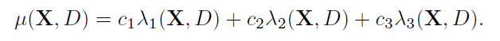
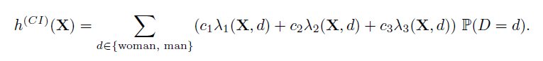
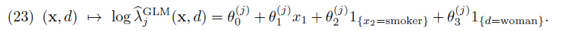

# **Discrimination-free Insurance Pricing: A simple example**

Jürg Schelldorfer, with support from Mario V. Wüthrich

2021-07-30

# Introduction

This notebook was created for the course "Deep Learning with Actuarial Applications in R" of the Swiss Association of Actuaries (https://www.actuaries.ch/).

This notebook serves as companion to the paper “Discrimination-Free Insurance Pricing”, available on [SSRN](https://papers.ssrn.com/sol3/papers.cfm?abstract_id=3520676).

The code has been shared by Mario Wüthrich and is not public.

Note that the results might vary depending on the R and Python package versions, see last section for the result of `sessionInfo()` and corresponding info on the Python setup.

# Global settings

## Load packages and data

```{r}
library(tidyr)
library(ggplot2)
library(gridExtra)
library(repr)  # not needed in the Rmarkdown version, only for Jupyter notebook
```

```{r}
# plotting parameters in R Markdown notebook
knitr::opts_chunk$set(fig.width = 18, fig.height = 9)
# plotting parameters in Jupyter-notebook
# https://stackoverflow.com/questions/42729049/how-to-change-the-size-of-r-plots-in-jupyter
options(repr.plot.width = 18, repr.plot.height = 9)
```

## Set global parameters

```{r}
ylims <- c(0.14, 0.33)
ylims_freq <- c(0, 0.33)
# random seed for reproducibility
seed <- 100
```

## Helper functions

Subsequently, for ease of reading, we provide all the helper functions which are used in this tutorial in this section.

```{r}
plot_prices <- function(data, title, legend_title, y_label,
                        labels, linetypes, colors) {
  data_gg <- gather(df, key = price_type, value = price, -ages)

  ggplot(data_gg, aes(x = ages, y = price, group = price_type,
                      colour = price_type, linetype = price_type)) +
    geom_line(size = 1) +
    scale_linetype_manual(labels = labels, values = linetypes, name = legend_title) +
    scale_color_manual(labels = labels, values = colors, name = legend_title) +
    labs(title = title, x = "age", y = y_label) +
    theme(legend.position = c(0.75, 0.87), legend.text = element_text(size = 12),
          text = element_text(size = 15), legend.key.width = unit(1.5, "cm"))
}
```

# Define the true prices

We present a simple health insurance example, demonstrating the approach to discrimination-free pricing. The example we present satisfies the causal relations of Figure 1, such that discrimination-free prices can be understood as reflecting direct unconfounded) causal effects (in an insured sub-population).

- Let $D$ correspond to the single discriminatory characteristic gender, that is, $D \in \{woman, man\}$.
- Let $X = (X_1, X_2)$, where $X_1 \in \{15,...,80\}$ denotes the age of the policyholder, and $X_2 \in \{non-smoker, smoker\}$.

Below we assume that smoking habits are gender related. We consider three different types of health costs:

1. **Type 1**: Birthing related health costs only affecting women between ages 20 and 40
2. **Type 2**: Cancer related health costs with a higher frequency for smokers and also for women
3. **Type 3**: Health costs due to other disabilities

For simplicity, we only consider claim counts, assuming deterministic claim costs for the three different claim types. Moreover, we model all individuals as independent, having the same exposure (= 1). We assume that the claim counts for the different
claim types are described by independent Poisson GLMs with canonical (i.e. log-) link function.

```{r}
ages <- c(15:80)
nAges <- length(ages)
```

The three different types of claims are governed by the following log-frequencies:


based on the joint non-discriminatory and discriminatory covariates $(X, D)$. The
deterministic claims costs of the different claim types are given by $(c_1, c_2, c_3) =
(0.5, 0.9, 0.1)$ for claims of type 1, type 2, and type 3, respectively.

```{r}
claimCost <- c(0.5, 0.9, 0.1)
```

## Best-Estimate Price

The best-estimate price (considering all covariates) is given by:



This best-estimate price is illustrated below for the parameter values

- $(\alpha_0, \alpha_1) = (-40, 38.5)$
- $(\beta_0,\beta_1, \beta_2, \beta_3) = (-2, 0.004, 0.1, 0.2)$
- $(\gamma_0, \gamma_1) = (-2, 0.01)$

```{r}
alpha0 <- c(-40, 38.5)
beta0 <- c(-2, 0.004, 0.1, 0.2)
gamma0 <- c(-2, 0.01)
```

```{r}
price_true_best_estimate <- array(NA, c(nAges, 4), dimnames = list(NULL, NULL))
colnames(price_true_best_estimate) <- c("woman-non-smoker", "woman-smoker",
                                        "man-non-smoker", "man-smoker")

# woman and non-smoker
price_true_best_estimate[, "woman-non-smoker"] <-
  claimCost[1] * exp(alpha0[1] + alpha0[2]*(ages >= 20)*(ages <= 40)) +
  claimCost[2] * exp(beta0[1] + beta0[2]*ages + beta0[4]) +
  claimCost[3] * exp(gamma0[1] + gamma0[2]*ages)

# woman and smoker
price_true_best_estimate[, "woman-smoker"] <-
  claimCost[1] * exp(alpha0[1] + alpha0[2]*(ages >= 20)*(ages <= 40)) +
  claimCost[2] * exp(beta0[1] + beta0[2]*ages + beta0[3] + beta0[4]) +
  claimCost[3] * exp(gamma0[1] + gamma0[2]*ages)

# man and non-smoker
price_true_best_estimate[, "man-non-smoker"] <-
  claimCost[1] * exp(alpha0[1]) +
  claimCost[2] * exp(beta0[1] + beta0[2]*ages) +
  claimCost[3] * exp(gamma0[1] + gamma0[2]*ages)

# man and smoker
price_true_best_estimate[, "man-smoker"] <-
  claimCost[1] * exp(alpha0[1]) +
  claimCost[2] * exp(beta0[1] + beta0[2]*ages + beta0[3]) +
  claimCost[3] * exp(gamma0[1] + gamma0[2] * ages)
```

```{r}
summary(price_true_best_estimate)
```

```{r}
legend_title <- "Price"
y_label <- "true prices"
labels <- c("best-estimate price (women)", "best-estimate price (men)")
linetypes <- c("solid", "solid")
colors <- c("blue", "black")

# Smokers
df <- data.frame(ages,
                 be_women = price_true_best_estimate[, "woman-smoker"],
                 be_men = price_true_best_estimate[, "man-smoker"])

p1 <- plot_prices(df, title = "Smokers", legend_title, y_label,
                  labels, linetypes, colors) + ylim(ylims)

# Non-smokers
df <- data.frame(ages,
                 be_women = price_true_best_estimate[, "woman-non-smoker"],
                 be_men = price_true_best_estimate[, "man-non-smoker"])

p2 <- plot_prices(df, title = "Non-Smokers", legend_title, y_label,
                  labels, linetypes, colors) + ylim(ylims)

grid.arrange(p1, p2, ncol = 2)
```

The first plot refers to smokers ($X_2 = smoker$), while the second to non-smokers ($X_2 = non-smoker$). The solid black lines give the best-estimate prices $\mu(X,D)$ for women and the solid red lines for men. Obviously, these best-estimate prices discriminate between genders.

## Discrimination-free Price

Next, we calculate the discrimination-free price. It is given by



For the calculation of this discrimination-free price we need the gender proportions
within our population. We set $P(D = woman) = 0.45$.

```{r}
womanProp <- 0.45
```

```{r}
price_true_disc_free <- array(NA, c(nAges, 2), dimnames = list(NULL, NULL))
colnames(price_true_disc_free) <- c("non-smoker", "smoker")
# non-smoker non-discriminating
price_true_disc_free[, "non-smoker"] <-
  womanProp * price_true_best_estimate[, "woman-non-smoker"] +
  (1 - womanProp) * price_true_best_estimate[, "man-non-smoker"]
# smoker non-discriminating
price_true_disc_free[, "smoker"] <-
  womanProp * price_true_best_estimate[, "woman-smoker"] +
  (1 - womanProp) * price_true_best_estimate[, "man-smoker"]
```

```{r}
summary(price_true_disc_free)
```

```{r}
legend_title <- "Price"
y_label <- "true prices"
labels <- c("best-estimate price (women)", "best-estimate price (men)",
            "discrimination-free price")
linetypes <- c("solid", "solid", "longdash")
colors <- c("blue", "black", "green")

# Smokers
df <- data.frame(ages, be_women = price_true_best_estimate[, "woman-smoker"],
                 be_men = price_true_best_estimate[, "man-smoker"],
                 df = price_true_disc_free[, "smoker"])

p1 <- plot_prices(df, title = "Smokers", legend_title, y_label,
                  labels, linetypes, colors) + ylim(ylims)

# Non-smokers
df <- data.frame(ages,
                 be_women = price_true_best_estimate[, "woman-non-smoker"],
                 be_men = price_true_best_estimate[, "man-non-smoker"],
                 df = price_true_disc_free[, "non-smoker"])

p2 <- plot_prices(df, title = "Non-smokers", legend_title, y_label,
                  labels, linetypes, colors) + ylim(ylims)

grid.arrange(p1, p2, ncol = 2)
```

The green dotted lines provide the resulting discrimination-free prices for smokers and non-
smokers. Note that these are identical for men and women, such that all price differences can be described solely by different ages $X_1$ and smoking habits $X_2$, irrespective of gender $D$. Moreover, the smoking habits do not allow us to infer the gender; note that in the exposition so far, it has not been necessary to described
how smoking habits vary by gender.

## Unawareness Price

We compare this discrimination-free price to the unawareness price obtained by
simply dropping the gender covariate $D$ from the calculations. Thus,
we calculate


The unawareness price requires additional information about the following conditional probabilities


The last equality following from assuming that the age variable $X_1$ is independent from the random vector $(X_2,D)$. In addition, we set $P(D = woman | X2 = smoker) = 0.8$ and $P(X_2 = smoker) = 0.3$. The former assumption tells us that smokers are more likely women; this is similar to Example 1. As a consequence, $X_2$ has explanatory power to predict the gender $D$, and the unawareness price will therefore be indirectly discriminatory against women.

```{r}
smokerProp <- 0.3
womanSmokerProp <- 0.8
```

```{r}
# woman conditional on non-smoking
womanNonSmokerProp <- (womanProp - womanSmokerProp * smokerProp) / (1 - smokerProp)

price_true_unaware <- array(NA, c(nAges, 2), dimnames = list(NULL, NULL))
colnames(price_true_unaware) = c("non-smoker", "smoker")
# non-smoker conditional
price_true_unaware[, "non-smoker"] <-
  womanNonSmokerProp * price_true_best_estimate[, "woman-non-smoker"] +
  (1 - womanNonSmokerProp) * price_true_best_estimate[, "man-non-smoker"]
# smoker conditional
price_true_unaware[, "smoker"] <-
  womanSmokerProp * price_true_best_estimate[, "woman-smoker"] +
  (1 - womanSmokerProp) * price_true_best_estimate[, "man-smoker"]
```

```{r}
summary(price_true_unaware)
```

These unawareness prices are illustrated by the red dotted lines in the figure below. The red dotted line lies above
the discrimination-free price (green) for smokers and below for non-smokers. Thus, the unawareness price implicitly allocates a higher price to women because smokers are more likely women.

```{r}
legend_title <- "Price"
y_label <- "true prices"
labels <- c("best-estimate price (women)", "best-estimate price (men)",
            "discrimination-free price", "unawareness price")
linetypes <- c("solid", "solid", "longdash", "dotted")
colors <- c("blue", "black", "green", "red")

# Smokers
df <- data.frame(ages,
                 be_women = price_true_best_estimate[, "woman-smoker"],
                 be_men = price_true_best_estimate[, "man-smoker"],
                 df = price_true_disc_free[, "smoker"],
                 un = price_true_unaware[, "smoker"])

p1 <- plot_prices(df, title = "Smokers", legend_title, y_label,
                  labels, linetypes, colors) + ylim(ylims)

# Non-smokers
df <- data.frame(ages,
                 be_women = price_true_best_estimate[, "woman-non-smoker"],
                 be_men = price_true_best_estimate[, "man-non-smoker"],
                 df = price_true_disc_free[, "non-smoker"],
                 un = price_true_unaware[, "non-smoker"])

p2 <- plot_prices(df, title = "Non-smokers", legend_title, y_label,
                  labels, linetypes, colors) + ylim(ylims)

grid.arrange(p1, p2, ncol = 2)
```

# Creating the portfolio of policyholders

The previous discussion has been based on the knowledge of the model generating the data. We now address the more realistic situation where the model needs to be estimated. To this effect, we simulate data from $(X, D, Y) \sim P$ consistently with the given model assumptions, and subsequently calibrate a regression model to the simulated data.

Specifically, we choose a health insurance portfolio of size $n = 100000$, and simulate claim counts from the Poisson GLMs (19), (20), and (21), with the choice $P(D = woman | X_2 = smoker) = 0.8$.

```{r}
nPolicies <- 100000
```

An age distribution for $X_1$ is also needed for the simulation; the chosen probability weights are shown below. We assume that age $X_1$ is independent from gender $D$ and smoking habits $X_2$, as in (22).

```{r}
agePattern <- dnorm(x = ages / 100, mean = 0.45, sd = 0.2)
ageProp <- agePattern / sum(agePattern)
```

```{r, fig.height=9, fig.width=9}
# custom plot size for this plot (Jupyter, done with chunk options R Markdown)
options(repr.plot.width = 9, repr.plot.height = 9)
ggplot(data = data.frame(ages = ages, ageProp = ageProp), aes(x = ages, y = ageProp)) +
  geom_step() +
  labs(title = "Age distribution", y = "age", y = "frequency")
# reset original
options(repr.plot.width = 18, repr.plot.height = 9)
```

```{r}
X <- matrix(0, nrow = nPolicies, ncol = 2)
D <- matrix(0, nrow = nPolicies, ncol = 1)

set.seed(seed)
nWomen <- rbinom(n = 1, size = nPolicies, prob = womanProp)
nSmokingWomen <- rbinom(n = 1, size = nWomen,
                        prob = womanSmokerProp * smokerProp / womanProp)
nSmokingMen <- rbinom(n = 1, size = nPolicies - nWomen,
                      prob = (1 - womanSmokerProp) * smokerProp / (1 - womanProp))
probWoman <- nWomen / nPolicies

D[1:nWomen] <- 1
X[, 1] <- matrix(ages, nrow = 1, ncol = nAges) %*%
          rmultinom(n = nPolicies, size = 1, prob = ageProp)
X[1:nSmokingWomen, 2] <- 1
X[(nWomen + 1):(nWomen + 1 + nSmokingMen), 2] <- 1

logMu1 <- alpha0[1] + alpha0[2] * (X[, 1] >= 20) * (X[, 1] <= 40) * D
logMu2 <- beta0[1] + beta0[2] * X[, 1] + beta0[3] * X[, 2] + beta0[4] * D
logMu3 <- gamma0[1] + gamma0[2] * X[, 1]

X1 <- X[, 1]
X2 <- X[, 2]

N1 <- rpois(n = nPolicies, lambda = exp(logMu1))
N2 <- rpois(n = nPolicies, lambda = exp(logMu2))
N3 <- rpois(n = nPolicies, lambda = exp(logMu3))

fullData <- data.frame(N1 = N1, N2 = N2, N3 = N3, X1 = X1, X2 = X2, D = D)
# randomize order because this can influence fitting
set.seed(50)  # NOTE: there is no strict need to set a new seed explicitly here
fullData <- fullData[sample(1:nrow(fullData)), ]
str(fullData)
```

The listing above gives an excerpt of the simulated data. We have the three covariates $X_1$ (age), $X_2$ (smoking habit) and $D$ (gender) on lines 5-7, and lines 2-4 illustrate the number of claims $N_1$, $N_2$ and $N_3$, separated by claim types. The proportion of women in this simulated data is 0.4505 which is close to the true value of $P(D = woman) = 0.45$. Our first aim is to fit a regression model to this data, under the assumptions that individual policies are independent, and that the different claim types are independent and Poisson distributed. Beside this, we do not make any
structural assumption about the regression functions, but we try to infer them from the data using regression models. The independence assumption between the claim counts $N_1$, $N_2$ and $N_3$ motivates modeling them separately. Thus, we will
fit three different regression models to model $\lambda_1$, $\lambda_2$ and $\lambda_3$, respectively. As we do
not use prior knowledge on the data generating process, we will feed all covariates $(X_1,X_2,D)$ to each of the three networks.

# Model 1: Generalized Linear Model

We first fit a simple generalized linear model ignoring the knowledge from the data generation process above. We choose a poor model by just assuming GLMs for $j = 1, 2, 3$



This model will perform well for $j = 2, 3$, see (20)-(21), but it will perform poorly for $j = 1$, see (19). This is because such a model has difficulties capturing the highly non-linear birthing related effects.

```{r}
womanSmoker <- data.frame(matrix(0, nrow = nAges, ncol = 3))
names(womanSmoker) <- c("X1", "X2", "D")
womanSmoker[, "X1"] <- ages
womanNonSmoker <- manSmoker <- manNonSmoker <- womanSmoker
womanSmoker[, "X2"] <- 1
manSmoker[, "X2"] <- 1
womanSmoker[, "D"] <- 1
womanNonSmoker[, "D"] <- 1
```

## Best-Estimate Price

First, we fit the frequency for every type of claims.

```{r}
glm1_be <- glm(N1 ~ X1 + X2 + D, data = fullData, family = poisson(link = "log"))
glm2_be <- glm(N2 ~ X1 + X2 + D, data = fullData, family = poisson(link = "log"))
glm3_be <- glm(N3 ~ X1 + X2 + D, data = fullData, family = poisson(link = "log"))
```

First, it is illustrative to look at the estimated frequencies by claims type.

```{r}
legend_title <- "Frequency"
y_label <- "estimated frequency"
labels <- c("man non-smoker", "man smoker",
            "woman non-smoker", "woman smoker")
linetypes <- c("solid", "dotdash", "solid", "dotdash")
colors <- c("black", "black", "blue", "blue")

# claims type 1
df <- data.frame(ages,
                 be_women_smoker = predict(glm1_be, newdata = womanSmoker, type = "response"),
                 be_women_nonsmoker = predict(glm1_be, newdata = womanNonSmoker, type = "response"),
                 be_men_smoker = predict(glm1_be, newdata = manSmoker, type = "response"),
                 be_men_nonsmoker = predict(glm1_be, newdata = manNonSmoker, type = "response"))

p1 <- plot_prices(df, title = "Claims type 1", legend_title, y_label,
                  labels, linetypes, colors) + ylim(ylims_freq)

# claims type 2
df <- data.frame(ages,
                 be_women_smoker = predict(glm2_be, newdata = womanSmoker, type = "response"),
                 be_women_nonsmoker = predict(glm2_be, newdata = womanNonSmoker, type = "response"),
                 be_men_smoker = predict(glm2_be, newdata = manSmoker, type = "response"),
                 be_men_nonsmoker = predict(glm2_be, newdata = manNonSmoker, type = "response"))

p2 <- plot_prices(df, title = "Claims type 2", legend_title, y_label,
                  labels, linetypes, colors) + ylim(ylims_freq)

# claims type 3
df <- data.frame(ages,
                 be_women_smoker = predict(glm3_be, newdata = womanSmoker, type = "response"),
                 be_women_nonsmoker = predict(glm3_be, newdata = womanNonSmoker, type = "response"),
                 be_men_smoker = predict(glm3_be, newdata = manSmoker, type = "response"),
                 be_men_nonsmoker = predict(glm3_be, newdata = manNonSmoker, type = "response"))

p3 <- plot_prices(df, title = "Claims type 3", legend_title, y_label,
                  labels, linetypes, colors) + ylim(ylims_freq)


grid.arrange(p1, p2, p3, ncol = 3)
```

Third, we calculate the best-estimate prices.

```{r}
price_glm_best_estimate <- array(0, c(nAges, 4), dimnames = list(NULL, NULL))
colnames(price_glm_best_estimate) <- colnames(price_true_best_estimate)

# woman and non-smoker
price_glm_best_estimate[, "woman-non-smoker"] <-
  claimCost[1] * predict(glm1_be, newdata = womanNonSmoker, type = "response") +
  claimCost[2] * predict(glm2_be, newdata = womanNonSmoker, type = "response") +
  claimCost[3] * predict(glm3_be, newdata = womanNonSmoker, type = "response")
# woman and smoker
price_true_best_estimate[, "woman-smoker"] <-
  claimCost[1] * predict(glm1_be, newdata = womanSmoker, type = "response") +
  claimCost[2] * predict(glm2_be, newdata = womanSmoker, type = "response") +
  claimCost[3] * predict(glm3_be, newdata = womanSmoker, type = "response")
# man and non-smoker
price_true_best_estimate[, "man-non-smoker"] <-
  claimCost[1] * predict(glm1_be, newdata = manNonSmoker, type = "response") +
  claimCost[2] * predict(glm2_be, newdata = manNonSmoker, type = "response") +
  claimCost[3] * predict(glm3_be, newdata = manNonSmoker, type = "response")
# man and smoker
price_true_best_estimate[, "man-smoker"] <-
  claimCost[1] * predict(glm1_be, newdata = manSmoker, type = "response") +
  claimCost[2] * predict(glm2_be, newdata = manSmoker, type = "response") +
  claimCost[3] * predict(glm3_be, newdata = manSmoker, type = "response")
```

```{r}
legend_title <- "Price"
y_label <- "true prices"
labels <- c("best-estimate price (women)", "best-estimate price (men)")
linetypes <- c("solid", "solid")
colors <- c("blue", "black")

# Smokers
df <- data.frame(ages,
                 be_women = price_true_best_estimate[, "woman-smoker"],
                 be_men = price_true_best_estimate[, "man-smoker"])

p1 <- plot_prices(df, title = "Smokers", legend_title, y_label,
                  labels, linetypes, colors) + ylim(ylims)

# Non-smokers
df <- data.frame(ages,
                 be_women = price_glm_best_estimate[, "woman-non-smoker"],
                 be_men = price_true_best_estimate[, "man-non-smoker"])

p2 <- plot_prices(df, title = "Non-smokers", legend_title, y_label,
                  labels, linetypes, colors) + ylim(ylims)

grid.arrange(p1, p2, ncol = 2)
```

## Discrimination-Free Price

We calculate the discrimination-free price based on the best-estimate prices.

```{r}
price_glm_disc_free <- array(NA, c(nAges, 2), dimnames = c(NULL, NULL))
colnames(price_glm_disc_free) <- c("non-smoker", "smoker")
# non-smoker non-discriminating
price_glm_disc_free[, "non-smoker"] <-
  probWoman * price_glm_best_estimate[, "woman-non-smoker"] +
  (1 - probWoman) * price_true_best_estimate[, "man-non-smoker"]
# smoker non-discriminating
price_glm_disc_free[, "smoker"] <-
  probWoman * price_true_best_estimate[, "woman-smoker"] +
  (1 - probWoman) * price_true_best_estimate[, "man-smoker"]
```

```{r}
legend_title <- "Price"
y_label <- "true prices"
labels <-  c("best-estimate price (women)", "best-estimate price (men)",
             "discrimination-free price")
linetypes <- c("solid", "solid", "longdash")
colors <- c("blue", "black", "green")

# Smokers
df <- data.frame(ages,
                 be_women = price_true_best_estimate[, "woman-smoker"],
                 be_men = price_true_best_estimate[, "man-smoker"],
                 df = price_glm_disc_free[, "smoker"])

p1 <- plot_prices(df, title = "Smokers", legend_title, y_label,
                  labels, linetypes, colors) + ylim(ylims)

# Non-smokers
df <- data.frame(ages, be_women = price_glm_best_estimate[, "woman-non-smoker"],
                 be_men = price_true_best_estimate[, "man-non-smoker"],
                 df = price_glm_disc_free[, "non-smoker"])

p2 <- plot_prices(df, title = "Non-smokers", legend_title, y_label,
                  labels, linetypes, colors) + ylim(ylims)

grid.arrange(p1, p2, ncol = 2)
```

## Unawareness Price

First, we fit the frequency for every type of claims, ignoring the information about $D$.

```{r}
glm1_un <- glm(N1 ~ X1 + X2 , data = fullData, family = poisson(link = "log"))
glm2_un <- glm(N2 ~ X1 + X2 , data = fullData, family = poisson(link = "log"))
glm3_un <- glm(N3 ~ X1 + X2 , data = fullData, family = poisson(link = "log"))
```

First, it is illustrative to look at the estimated frequencies by claims type.

```{r}
legend_title <- "Frequency"
y_label <- "estimated frequency"
labels <-  c("non-smoker", "smoker")
linetypes <- c("twodash", "dotdash")
colors <- c("yellow", "orange")

# claims type 1
df <- data.frame(ages,
                 be_smoker = predict(glm1_un, newdata = womanSmoker, type = "response"),
                 be_nonsmoker = predict(glm1_un, newdata = womanNonSmoker, type = "response"))

p1 <- plot_prices(df, title = "Claims type 1 (without gender)", legend_title, y_label,
                  labels, linetypes, colors) + ylim(ylims_freq)

# claims type 2
df <- data.frame(ages,
                 be_smoker = predict(glm2_un, newdata = womanSmoker, type = "response"),
                 be_nonsmoker = predict(glm2_un, newdata = womanNonSmoker, type = "response"))

p2 <- plot_prices(df, title = "Claims type 2 (without gender)", legend_title, y_label,
                  labels, linetypes, colors) + ylim(ylims_freq)

# claims type 3
df <- data.frame(ages,
                 be_smoker = predict(glm3_un, newdata = womanSmoker, type = "response"),
                 be_nonsmoker = predict(glm3_un, newdata = womanNonSmoker, type = "response"))

p3 <- plot_prices(df, title = "Claims type 3 (without gender)", legend_title, y_label,
                  labels, linetypes, colors) + ylim(ylims_freq)

grid.arrange(p1, p2, p3, ncol = 3)
```

The resulting estimated regression functions, ignoring gender information $D$, are illustrated above. The left-hand side shows that we can no longer distinguish between gender, however, smokers are more heavily punished for birthing related costs, which is an undesired indirect discrimination effect against women because they are more often among the group of smokers. Finally, merging the different claim types provides the estimated unawareness prices (when first dropping D) as illustrated by the red dotted lines below.

```{r}
price_glm_unaware <- array(0, c(nAges, 2), dimnames = c(NULL, NULL))
colnames(price_glm_unaware) <- c("non-smoker", "smoker")
# non-smoker
price_glm_unaware[, "non-smoker"] <-
  claimCost[1] * predict(glm1_un, newdata = womanNonSmoker, type = "response") +
  claimCost[2] * predict(glm2_un, newdata = womanNonSmoker, type = "response") +
  claimCost[3] * predict(glm3_un, newdata = womanNonSmoker, type = "response")
# smoker
price_glm_unaware[, "smoker"] <-
  claimCost[1] * predict(glm1_un, newdata = womanSmoker, type = "response") +
  claimCost[2] * predict(glm2_un, newdata = womanSmoker, type = "response") +
  claimCost[3] * predict(glm3_un, newdata = womanSmoker, type = "response")
```

In the following figure we present the resulting best-estimate prices, unawareness prices, and discrimination-free prices (in green longdashed lines), as estimated using the GLM. The first observation is that the resulting prices are a poor approximation to the true prices of the previous section, the latter assuming full knowledge of the true model. However,
the general discrimination behavior is the same in both figures, namely, that the unawareness price discriminates indirectly by learning the gender $D$ from smoking habits $X_2$. This is illustrated by the relative positioning of red and green lines, with smokers more heavily charged for birthing related costs due to the fact
that smokers are more likely women.

```{r}
legend_title <- "Price"
y_label <- "true prices"
labels <- c("best-estimate price (women)", "best-estimate price (men)",
            "discrimination-free price", "unawareness price")
linetypes <- c("solid", "solid", "longdash", "dotted")
colors <-  c("blue", "black", "green", "red")

# Smokers
df <- data.frame(ages,
                 be_women = price_true_best_estimate[, "woman-smoker"],
                 be_men = price_true_best_estimate[, "man-smoker"],
                 df = price_glm_disc_free[, "smoker"],
                 un = price_glm_unaware[, "smoker"])

p1 <- plot_prices(df, title = "Smokers", legend_title, y_label,
                  labels, linetypes, colors) + ylim(ylims)

# Non-smokers
df <- data.frame(ages,
                 be_women = price_glm_best_estimate[, "woman-non-smoker"],
                 be_men = price_true_best_estimate[, "man-non-smoker"],
                 df = price_glm_disc_free[, "non-smoker"],
                 un = price_glm_unaware[, "non-smoker"])

p2 <- plot_prices(df, title = "Non-smokers", legend_title, y_label,
                  labels, linetypes, colors) + ylim(ylims)

grid.arrange(p1, p2, ncol = 2)
```

# Conclusions

We can draw the following conclusions:

- If we want to avoid discrimination in insurance pricing, we need to have access to all discriminatory characteristics, otherwise it is not possible to properly adjust for the discriminatory characteristics' influence.
- We propose a simple formula for discrimination-free insurance pricing.
- First, we construct a price that is based on all available information, including discriminatory information.
- Second, we average out the effect of discriminatory information.
- This approach neither allows for direct nor for indirect discrimination.
- The omission of discriminatory information leads to indirect discrimination in prices.
- We illustrate that the (non-)discrimination property does not depend on the quality of the regression model chosen.

# Exercises

**Exercise:** Change the portfolio percentage of women (womanProp) and compare the result.

**Exercise:** Change the assumption of the probability of a women given it is a smoker.

**Exercise:** Change the claims costs.

**Exercise:** Change the parameters $\alpha$, $\beta$ and $\gamma$

**Exercise:** Change portfolio parameters and compare the results.

**Exercise:** Think about the overall prices received by the best estimate, discrimination-free and unawareness price. What does it mean for the insurance company?

**Exercise:** Plot the charts by claims type for the discrimination-free frequency and also for the true frequencies.

# Session Info

The html is generated with the follow packages (which might be slightly newer than the ones used in the published tutorial).

```{r}
sessionInfo()
```

# References

- [Discrimination-Free Insurance Pricing](https://papers.ssrn.com/sol3/papers.cfm?abstract_id=3520676)
- [The Proxy Problem](https://ethz.ch/content/dam/ethz/special-interest/math/risklab-dam/documents/The_Proxy_Problem.pdf)

